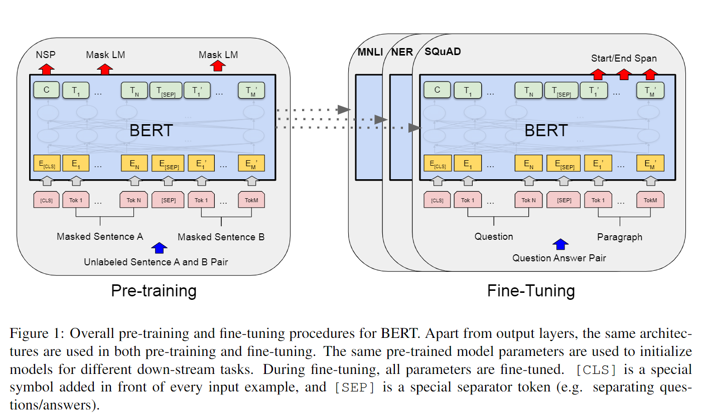

|标题|作者|阅读情况|DOI|
|:---|---|---|:---|
|BERT: Pre-training of Deep Bidirectional Transformers for Language Understanding|Jacob Devlin Ming-Wei Chang Kenton Lee Kristina ToutanovaGoogle AI Language|略读|arXiv:1810.04805v2|
>详解看CSDN:http://t.csdn.cn/dph7M
CSDN中指明了四种不同的微调任务

这里进行一下补充：
>解释整个工作中，“句子”可以是任何跨度的语言句子，‘序列是指输入到BERT的标签序列，可以是N个句子。
## 创新点
- 同时计算两个训练任务的loss进行计算。

- 通过对于mask机制的改进，使得模型更加考虑全文而不是上下文的内容。
  - 为了减轻，微调任务中没有mask使得训练和微调不匹配的情况。练数据生成器随机选择15%的令牌位置进行预测。如果第i个令牌被选中，我们用(1)80%的时间[MASK]令牌替换第i个令牌(2)10%的时间随机令牌(3)10%的时间不变的第i个令牌。
- 

## 模型结构
>模型结构主要是一个多层的transformer编码器。    
模型参数：BERT层数(即Transformer块)表示为L，隐藏尺寸asH，自注意头数表示为A。我们主要报告了两种模型尺寸的结果:BERTBASE (L=12, H=768, A=12，总参数=110M)和BERTLARGE (L=24, H=1024, A=16，总参数=340M)

BERT的预训练和微调程序
