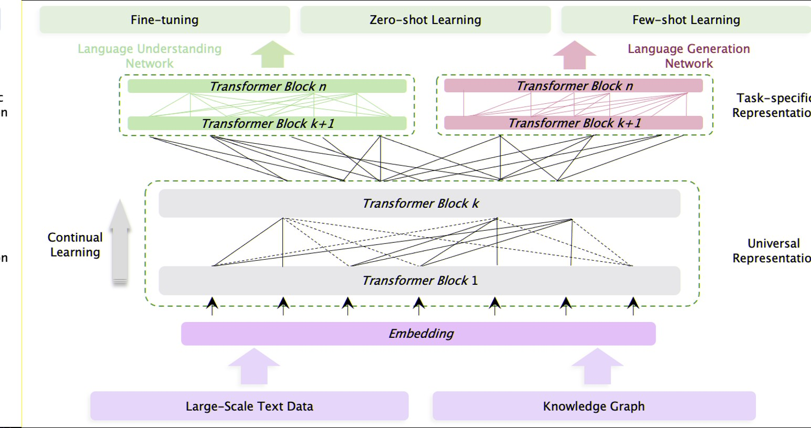

|标题|作者|期刊|DOI|
|:---|---|---:|:---|
|ERNIE 3.0: LARGE-SCALE KNOWLEDGE ENHANCEDPRE-TRAINING FOR LANGUAGE UNDERSTANDING ANDGENERATION|Yu Sun∗ Shuohuan Wang∗ Shikun Feng∗|

# 摘要
>ERNIE 3.0 是用于LLM的，因为大多数的LLM只是基于文本上的训练。例如：GPT-3 T5
>并且因为多数LLM是以自回归方式进行训练的。传统的微调方法在解决下游语言理解任务时表现出相对较弱的性能。

# 模型
## 假设
>假设 自然语言处理的不同任务范式一致依赖相同的底层抽象特征（句法信息，词汇信息等） 只是对于顶层的具体特征要求是不相容的，其中NLU倾向于学习语义一致性，NLG倾向于学习上下文信息。

## 阐明创新点

>提出本文创新点：与同意的预训练策略不同 文章采用了一种新的持续多范式统一预训练框架。

## 解释两个模块：

>开文总结：基于之前提到的特性，ERNIE3.0框架使得不同任务范式共享底层特征，利用特定任务网络来学习到特定任务的顶层具体特征。

- Universal Representation Module:
  - >作者提到：Universal Representation Moudule 模块基本与Transformer相似,与 Transformer-XL不同的是加入了一个辅助循环记忆模块，这里是因为受制于GPU限制，Transformer-XL所进行的是将抢一个segment的隐藏层信息输入下一层，这使得能考虑多少全文信息取决于GPU的运算能力。

- Task-specific Representation Module:
  - >任务特定表示模块也是一个多层的Transformer-XL，用于捕获不同任务范式的顶层语义表示。
  - >Task-special Representation Module这个模块也是用的Transformer -XL的只不过模型参数大小设置的是basenet的大小，这里提出选basenet的三个好处：1是有更好的语义捕捉能力，而是具有基本模型大侠的任务特定网络可以在不增加大规模模型参数的情况下区分不同任务范式信息。

- 模型结构如下

